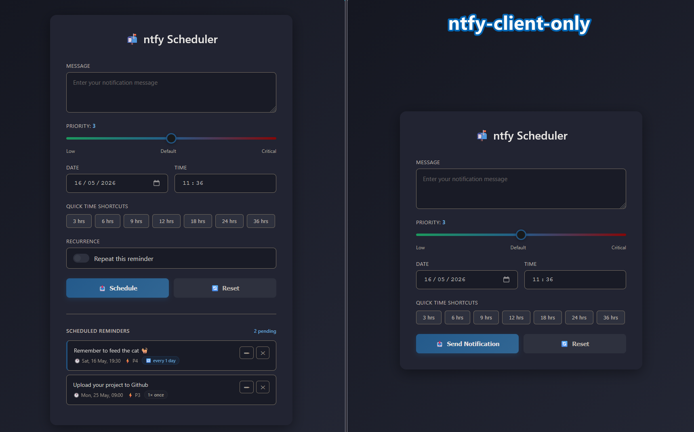

# ntfy Scheduler

A self-hosted notification scheduler for [ntfy](https://ntfy.sh) with support for one-time and recurring reminders. Reminders are persisted to a local JSON file and dispatched via cron, so they survive server restarts and updates.

## Screenshot


## Files

| File | Purpose |
|------|---------|
| `ntfy.html` | Web UI — schedule, edit, and delete reminders |
| `ntfy_server.py` | Flask server — serves the UI and exposes the REST API |
| `ntfy_dispatch.py` | Cron script — fires due reminders and reschedules recurring ones |
| `reminders.json` | Auto-created — stores all pending reminders |
| `ntfy-client-only.html` | Single-page html - no recurring reminders, runs client-side, no dependencies |

## Requirements

- Python 3.8+
- Ubuntu (or any Linux with cron)

## Setup

```bash
# Clone the repo
git clone https://github.com/yourusername/ntfy-scheduler.git
cd ntfy-scheduler

# Create and activate a virtual environment
python3 -m venv venv
source venv/bin/activate

# Install dependencies
pip install flask requests
```

## Configuration

Edit the top of each file to match your setup:

**`ntfy_server.py`** — change the host if needed (default is `0.0.0.0`; use `127.0.0.1` to restrict to localhost):
```python
app.run(host='127.0.0.1', port=5000)
```

**`ntfy_dispatch.py`** — set your ntfy server URL and topic:
```python
NTFY_BASE_URL = 'https://ntfy.sh/'
TOPIC         = 'your_topic_here'
```

## Running the Server

```bash
source venv/bin/activate
python3 ntfy_server.py
```

Then open `http://localhost:5000` in your browser.

## Cron Setup

Run `crontab -e` and add these two lines (adjust paths):

```
* * * * * /path/to/venv/bin/python3 /path/to/ntfy_dispatch.py >> /path/to/ntfy.log 2>&1
@reboot   /path/to/venv/bin/python3 /path/to/ntfy_server.py  >> /path/to/ntfy.log 2>&1 &
```

The dispatcher runs every minute and checks for due reminders. The `@reboot` line restarts the server automatically after a reboot.

### Optional: systemd (more robust)

```ini
# /etc/systemd/system/ntfy-scheduler.service
[Unit]
Description=ntfy Scheduler
After=network.target

[Service]
ExecStart=/path/to/venv/bin/python3 /path/to/ntfy_server.py
Restart=on-failure
User=youruser

[Install]
WantedBy=multi-user.target
```

```bash
sudo systemctl enable ntfy-scheduler
sudo systemctl start ntfy-scheduler
```

## Features

- Schedule one-time reminders at a specific date and time
- Schedule recurring reminders (every N hours / days / weeks / months)
- Edit any pending reminder — reloads it into the form
- Delete reminders
- Quick time shortcuts (3h, 6h, 12h, 24h, etc.)
- Priority slider (1–5)
- Reminders persist across server restarts — ntfy never holds the schedule
