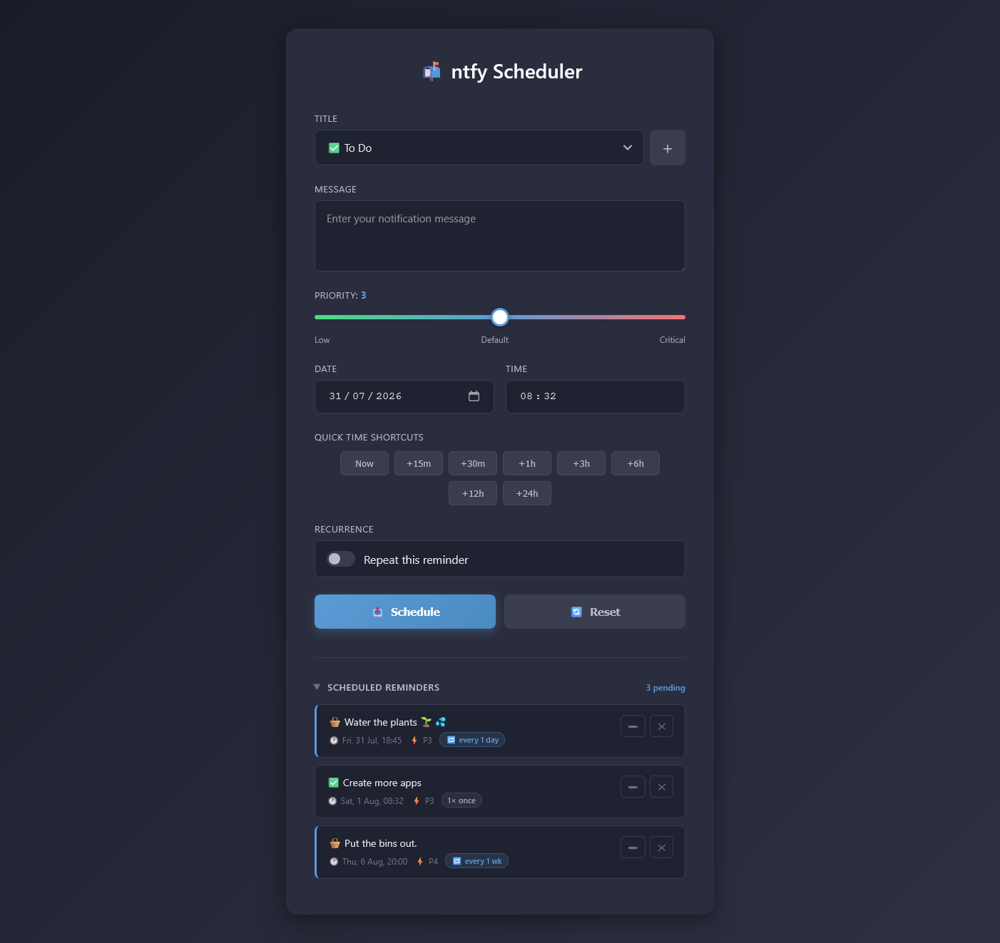

# ntfy Scheduler

A self-hosted notification scheduler for [ntfy](https://ntfy.sh) with support for one-time and recurring reminders. Reminders are persisted to a local JSON file and dispatched via cron, so they survive server restarts and updates.

## Screenshot


## Structure

```
ntfy-scheduler/
├── ntfy_server.py             Flask server — serves the UI and exposes the REST API
├── ntfy_dispatch.py           Cron script — fires due reminders, reschedules recurring ones
├── static/
│   └── ntfy.html              Web UI — schedule, edit, and delete reminders; manage titles + emoji
├── standalone/
│   ├── ntfy-client-only.html  No server needed — open directly in a browser; no recurring reminders
│   └── ntfy-client-demo.html  Demo version that allows ntfy.sh topic to be entered on screen. 
├── data/                      Auto-created at runtime, gitignored
│   ├── reminders.json         All pending (and recently-fired) reminders
│   └── titles.json            Your list of titles and their linked emoji
├── docs/
│   └── screenshot.png
├── .env                       Your config — topic, base URL, and optional extras (see below)
├── .env.example
└── requirements.txt
```

## Requirements

- Python 3.8+
- Ubuntu (or any Linux with cron)

## Setup

```bash
# Clone the repo
git clone https://github.com/yourusername/ntfy-scheduler.git
cd ntfy-scheduler

# Create and activate a virtual environment
python3 -m venv venv
source venv/bin/activate

# Install dependencies
pip install -r requirements.txt
```

## Configuration

Copy `.env.example` to `.env` and fill in your values:

```bash
cp .env.example .env
```

```dotenv
NTFY_BASE_URL=https://ntfy.sh
NTFY_TOPIC=your_topic_here

# Seeds titles.json the first time the server runs — after that, manage
# titles (add/rename/delete, and link an emoji to each) from the app itself.
NTFY_TITLES=To Do,Web Link,Housework

# LAN address of this app, used to build the notification's "Reschedule" action button.
# Leave blank to disable that button.
NTFY_SCHEDULER_URL=http://your-server:5000

# Optional PNG shown as the notification icon
NTFY_ICON_URL=http://your-server:5000/static/icon.png
```

`.env` is gitignored — never commit it. Since the topic is your only access control on the public `ntfy.sh` relay, use a long, hard-to-guess one (or self-host ntfy).

To restrict the server to localhost only, edit the bottom of `ntfy_server.py`:
```python
app.run(host='127.0.0.1', port=5000)
```

## Running the Server

```bash
source venv/bin/activate
python3 ntfy_server.py
```

Then open `http://localhost:5000` in your browser.

To pick up code or `.env` changes, restart it: `Ctrl+C` then re-run, or `sudo systemctl restart ntfy-scheduler` if you've set it up as a service (see below). The cron-run dispatcher doesn't need restarting — it re-reads `.env` and `reminders.json` fresh every run.

## Cron Setup

Run `crontab -e` and add these two lines (adjust paths):

```
* * * * * /path/to/venv/bin/python3 /path/to/ntfy_dispatch.py >> /path/to/ntfy.log 2>&1
@reboot   /path/to/venv/bin/python3 /path/to/ntfy_server.py  >> /path/to/ntfy.log 2>&1 &
```

The dispatcher runs every minute and checks for due reminders. The `@reboot` line restarts the server automatically after a reboot.

### Optional: systemd (more robust)

```ini
# /etc/systemd/system/ntfy-scheduler.service
[Unit]
Description=ntfy Scheduler
After=network.target

[Service]
ExecStart=/path/to/venv/bin/python3 /path/to/ntfy_server.py
Restart=on-failure
User=youruser

[Install]
WantedBy=multi-user.target
```

```bash
sudo systemctl enable ntfy-scheduler
sudo systemctl start ntfy-scheduler
```

## Features

- Schedule one-time reminders at a specific date and time
- Schedule recurring reminders (every N hours / days / weeks / months)
- Titles are managed in-app (add, rename, delete) and each can have an emoji linked to it,
  picked from a curated set based on [ntfy's supported emoji](https://docs.ntfy.sh/emojis/) —
  sent as the notification's `Tags` header rather than embedded in the title, since ntfy's
  `Title` header only accepts Latin-1 text
- Edit any pending reminder — reloads it into the form
- Delete reminders
- Reschedule directly from the notification: tap the "Reschedule" action button to reopen
  the app with that reminder loaded, ready to pick a new time. One-time reminders are kept
  for 24 hours after firing so this still works after the fact; recurring reminders are
  cloned into a fresh one-off so their regular schedule isn't disturbed
- Quick, cumulative time shortcuts (1h, 3h, 9h, 12h, 18h, 24h, 36h) — each click adds to
  whatever's currently in the date/time fields
- Priority slider (1–5)
- Collapsible "Scheduled Reminders" list (collapsed by default)
- Reminders persist across server restarts — ntfy never holds the schedule

